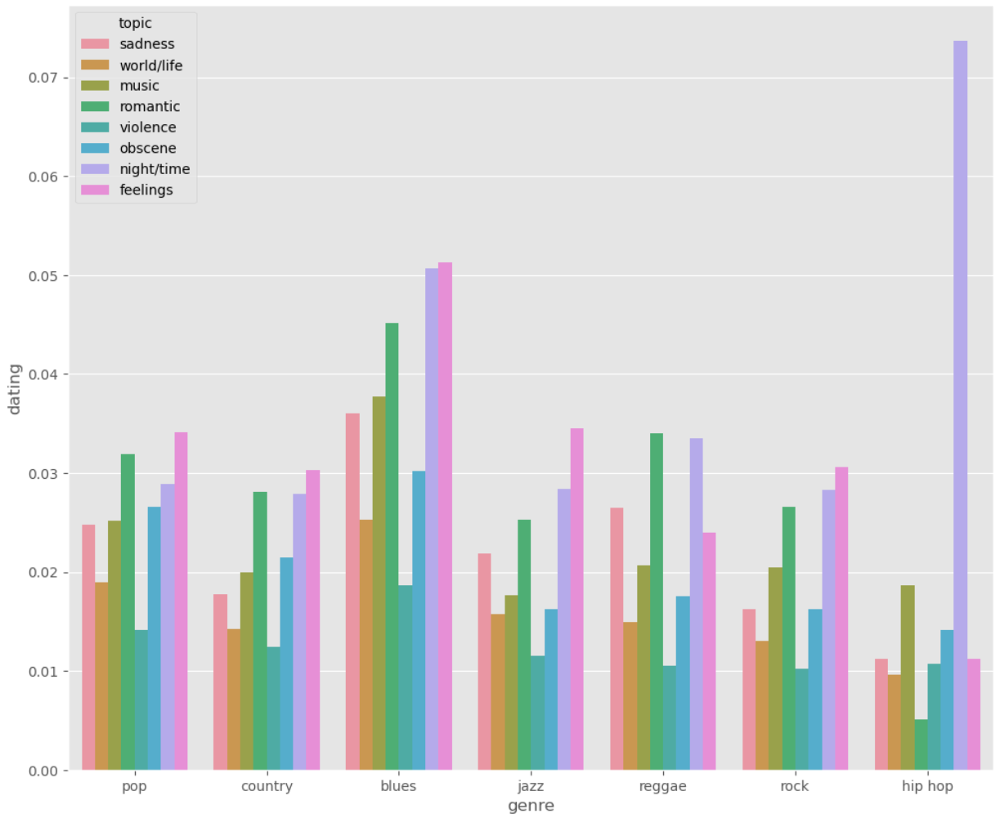
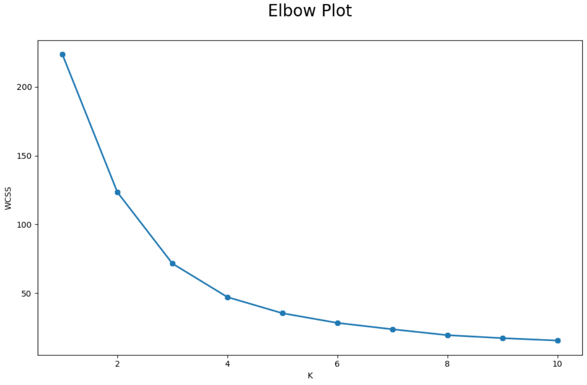

# Audio-RA-project

This Project is based on a music dataset to apply the unsupervised machine learning model, through the k-Means clustering algorithm

The first approach was to do the exploratory data analysis (EDA) through univariate, bivariate and multivariate.

###### Correlation between Genre and feelings

In the data cleaning and pre-processing, unnessary columns were dropped, that were object datatypes that did not apply to the machine learning model.

Two variables were analyzed, dating and feelings. How feelings affect songs to dating.

The elbow method was able to identify the total number of clusters. The Kmeans clustering algorithm returned a total of four clusters.

##### References

_Music Dataset: Lyrics and Metadata from 1950 to 2019
[https://data.mendeley.com/datasets/3t9vbwxgr5/3]()_

_Data Reporting reference_
 _[The impact of free-ranging domestic cats on wildlife of the United States](https://www.nature.com/articles/ncomms2380)_

TKH - labs
 2.12, Slides:11/29

_Stack oveflow_
_[https://stackoverflow.com/]()_

_Kmean clusteting implementation_
[https://scikit-learn.org/stable/modules/generated/sklearn.cluster.KMeans.html](https://scikit-learn.org/stable/modules/generated/sklearn.cluster.KMeans.html)
